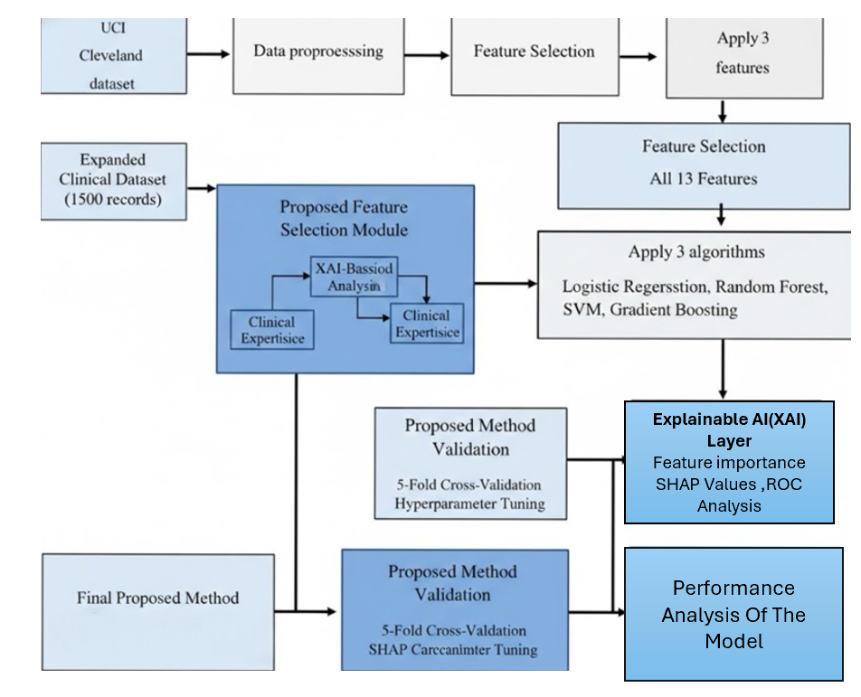

# Heart Disease Prediction using Machine Learning with XAI

## Project Description
This project predicts the risk of heart disease using multiple machine learning algorithms such as Logistic Regression, SVM, Random Forest, and XGBoost. The model performance is evaluated using accuracy, precision, recall, F1-score, and ROC-AUC.

Explainable AI (XAI) techniques are used to interpret the model predictions and identify important clinical features.

## Folder Structure
Heart-Disease-Prediction-XAI/
│
├── src/
│ └── heart_disease_prediction.ipynb
├── docs/
├── README.md
├── requirements.txt
├── architecture.png
├── demo_video_link.txt
└── setup_instructions.md
## System Architecture

## Conclusion

This project successfully predicts heart disease risk using multiple machine learning models and enhances transparency using Explainable AI techniques. The system helps in early risk identification and supports clinical decision-making.
